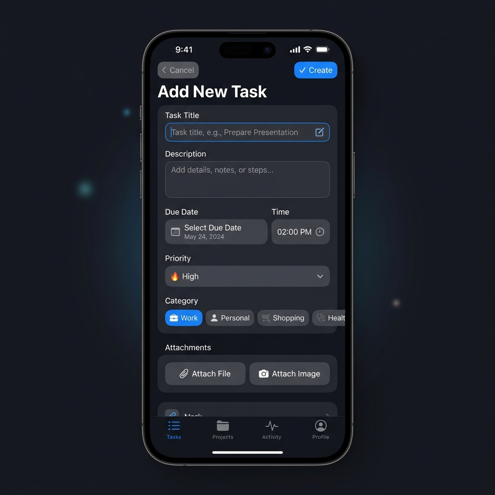

# Task Manager App - React Native & Expo Router

A modern, cross-platform mobile application for efficient task management, developed using **React Native**, **Expo SDK 51**, and **Expo Router**.

---

## 📱 App Screenshots

| Home Screen (Dark Mode) | Add / Edit Task Screen |
| :---: | :---: |
|  |  |

---

## ✨ Features

- 📝 **Full Task Lifecycle**: Create, edit, inspect, complete, and delete tasks.
- 🎨 **Adaptive Dark & Light Theme**: Toggle between dark mode and light mode with custom React Native Paper styling.
- 🏷️ **Categorization & Priority**: Organize tasks by category (*Work, Personal, Shopping, Other*) and set priority levels (*High, Medium, Low*).
- 📅 **Due Dates & Timers**: Set due dates with native date/time pickers and formatting.
- 📎 **File & Image Attachments**: Attach images and document files directly to tasks.
- 🔍 **Real-Time Search & Filtering**: Instant search across titles/descriptions with category and priority filtering.
- 🔄 **Restore Default Tasks**: Instantly seed or reset to 15 pre-loaded sample tasks from Settings.
- 💾 **Persistent Offline Storage**: Data persisted locally via `@react-native-async-storage/async-storage`.

---

## 🛠️ Technology Stack

- **Framework**: React Native (`v0.74.5`) & Expo (`v51.0.28`)
- **Routing**: Expo Router (`v3.5.23`)
- **UI Library**: React Native Paper (`v5.12.5`) & `@expo/vector-icons`
- **State Management**: React Context API (`TaskContext` & `DrawerContext`)
- **Storage**: `@react-native-async-storage/async-storage`
- **Date Formatting**: `date-fns` & `@react-native-community/datetimepicker`
- **Pickers**: `expo-document-picker` & `expo-image-picker`

---

## 📂 Project Structure

```text
TaskManager/
├── App.js                     # Root entry point with GestureHandlerRootView
├── app/                       # Expo Router file-based routes
│   ├── _layout.js             # Master layout provider wrapper
│   ├── index.js               # Main Home screen (Task list & search)
│   ├── task-list.js           # Categorized Task list screen with filter menus
│   ├── add-task.js            # Task creation screen with date & file pickers
│   ├── edit-task/
│   │   └── [id].js            # Task detail & editing screen
│   └── settings.js            # Settings screen (Dark mode, Reset tasks)
├── components/                # Reusable UI components
│   ├── CustomDrawerContent.js # Animated side navigation drawer
│   ├── SplashScreen.js        # Loading splash screen
│   └── TaskList.js            # Task list item wrapper
├── context/                   # React Context state management
│   ├── TaskContext.js         # Core task data, CRUD logic, & default tasks
│   └── DrawerContext.js       # Drawer open/close state context
├── assets/                    # Static assets & app icons
│   └── screenshots/           # Application screenshots for documentation
├── package.json               # Dependencies & dependency overrides
└── babel.config.js            # Babel configuration
```

---

## 🚀 Getting Started

### Prerequisites

Ensure you have **Node.js** (v18+) and **npm** installed on your machine.

### Installation

1. Clone the repository:
   ```bash
   git clone https://github.com/praiseOjay/TaskManager.git
   cd TaskManager
   ```

2. Install dependencies:
   ```bash
   npm install
   ```

3. Start the Expo development server:
   ```bash
   npx expo start
   ```

4. Run on your preferred platform:
   - **Android**: Press `a` in the terminal (or run `npm run android`)
   - **iOS**: Press `i` in the terminal (or run `npm run ios`)
   - **Web**: Press `w` in the terminal (or run `npm run web`)

---

## 👤 Author & Contact

- **Author**: Praise Ojerinola
- **Email**: Ojerinolapraise@gmail.com
- **Repository**: [https://github.com/praiseOjay/TaskManager](https://github.com/praiseOjay/TaskManager)

---

## 📄 License

This project is licensed under the MIT License - see the [LICENSE.md](LICENSE.md) file for details.

